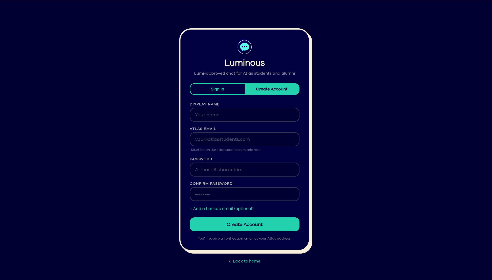
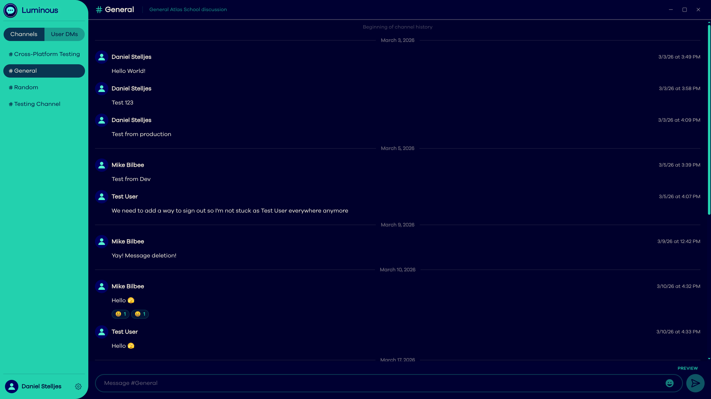
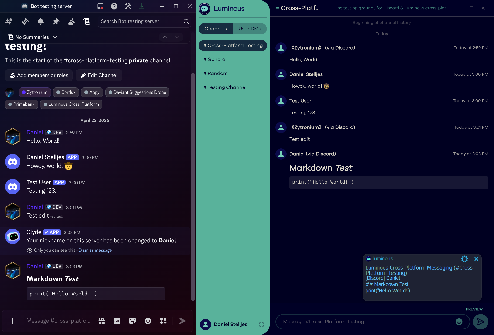
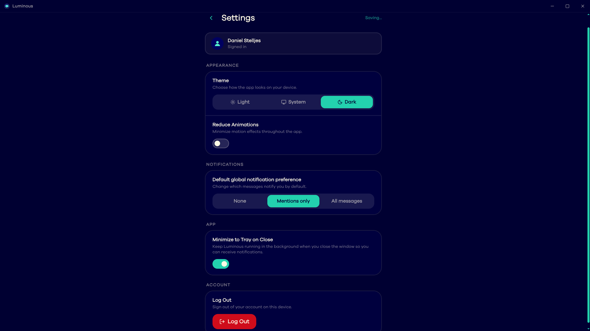
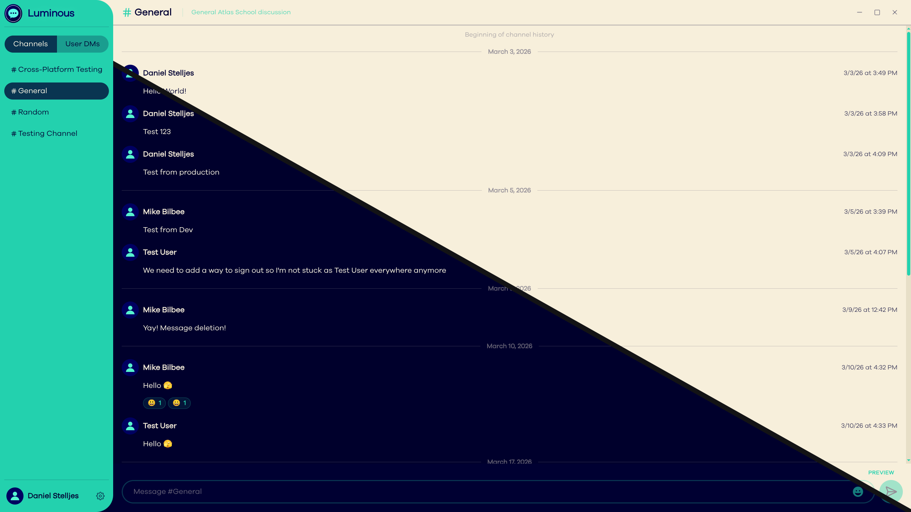

# Luminous

> The exclusive chat app for students and graduates of [Atlas School](https://www.atlasschool.com/) --
> built by alumni, for alumni.

---

## Overview

Luminous is an open-source chat platform designed specifically for the Atlas School community,
though not officially affiliated with Atlas School. Think of it as a Discord *server*, not a 
Discord clone. It's one unified space with multiple channels and private messaging, built from 
scratch by the same people who will be using it.

---

## Screenshots

> The app is in active development. Screenshots reflect the current state of the UI as of the last update to this readme.

### Login & Sign-Up

### Channels

### Cross-Platform Messaging <small>(experimental prototype)</small>

### User Settings

### Themes

---

## Tech Stack

| Layer       | Technology                               |
|-------------|------------------------------------------|
| Frontend    | Next.js, React, Tailwind CSS, TypeScript |
| Backend     | Express.js API, Python Discord bot       |
| Database    | Supabase                                 |
| Deployment  | Vercel                                   |
| Desktop App | Electron                                 |

---

## Planned Features

- Account creation restricted to `@atlasstudents.com` emails (verified) to significantly reduce or eliminate bot activity
- Channels, DMs, and group chats 
- Custom emoji
- Cross-platform support (web + desktop via Electron)
- Cross-platform messaging with Discord (and potentially Root in the future) via bot & webhook
- Just about everything else Discord has for free except servers - it will be one big server

### Stretch Goals
- End-to-end encryption
- Voice and/or video calls
- Premium features and/or donations to help support infrastructure costs
- Two-factor authentication

### Expected Challenges:
- Polishing the experimental cross-platform messaging to work reliably 24/7
- Implementing stretch goals
- Affording infrastructure costs for image and video hosting

---

## Getting Started

Luminous requires a valid Atlas School email to sign up. If you are an Atlas School student or graduate, go to 
https://luminous-chat.vercel.app/ and sign up. Please understand that Luminous is in a testing phase and not yet
production ready.

---

## Contributors

| Name            | GitHub                                           | Role                                                 |
|-----------------|--------------------------------------------------|------------------------------------------------------|
| Daniel Stelljes | [@Zytronium](https://github.com/Zytronium)       | Project Lead, Front-end Designer, Back-end Developer |
| Mike Bilbee     | [@MikeBilbee](https://github.com/MikeBilbee)     | Full-stack Developer                                 |
| Evan Richardson | [@evanrich2404](https://github.com/evanrich2404) | Full-stack Developer                                 |
| Anonymous       | --                                               | Database Developer, Cybersecurity Expert             |
